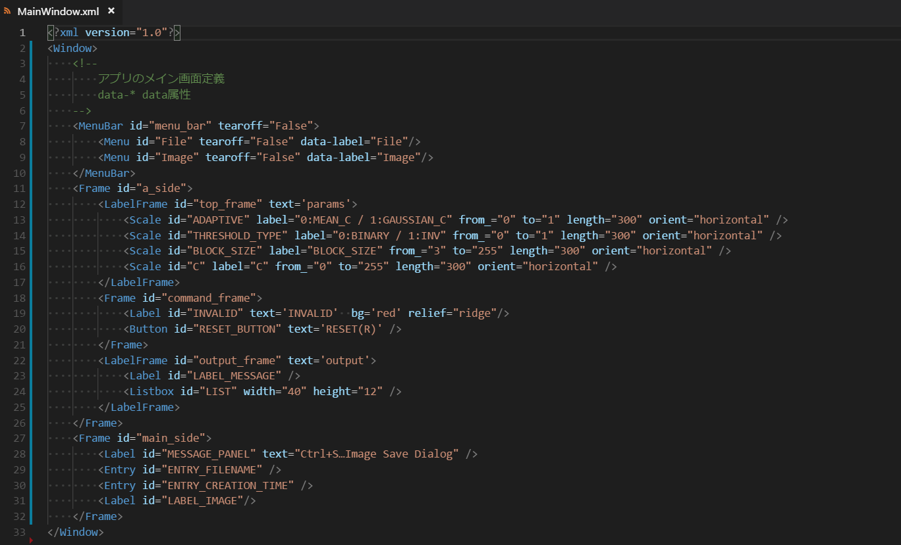

## Introduction
Proof of Concept.
Define the screen layout of tkinter with an XML file.


## Screenshot
- XML file define.

- Create tkinter widget


## Synopsis
```
python gui.py
```

## Source code License.
[MIT License](LICENSE)